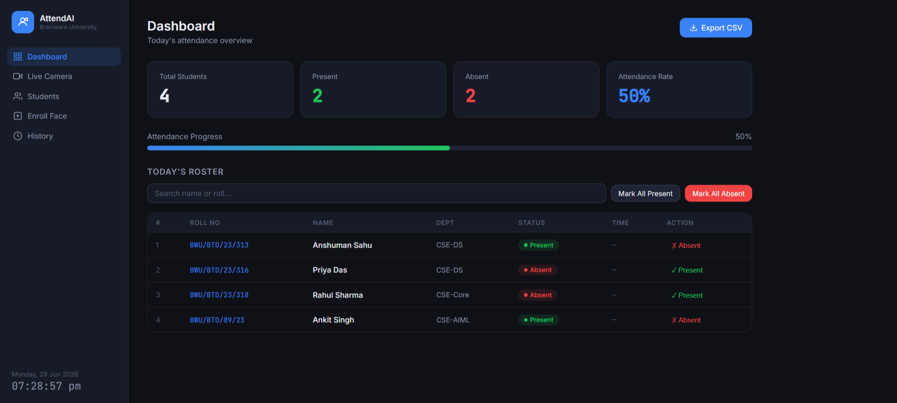
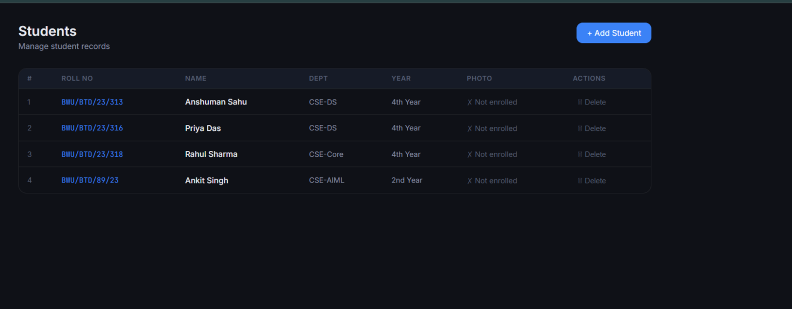
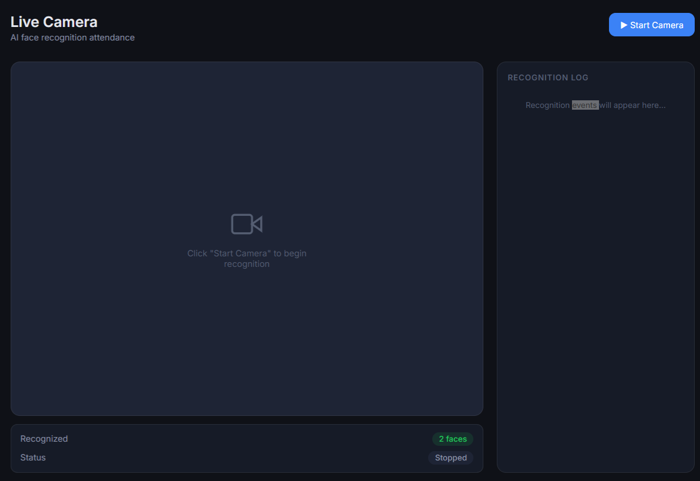

# 🎯 AttendAI - AI Based Student Attendance System

An AI-powered student attendance system that uses **Face Recognition** to automatically mark attendance and manage student records.

## 🚀 Features
- Face Recognition Based Attendance
- Student Management System
- Live Camera Attendance
- Attendance History
- Export Attendance to CSV
- Modern Dashboard Interface

## 🛠️ Tech Stack
- Python
- Flask
- OpenCV
- NumPy
- Pandas
- HTML, CSS, JavaScript

## 📸 Screenshots

### Dashboard


### Student Management


### Live Camera


### Attendance History


## ⚙️ Installation

```bash
git clone https://github.com/Anshumansahu87/AttendAI_Project.git
cd AttendAI_Project
pip install -r requirements.txt
python app.py
```

## 👨‍💻 Author

**Anshuman Sahu**  
B.Tech CSE (Data Science) Student  
📧 anshu87093@gmail.com  
🌐 GitHub: https://github.com/Anshumansahu87

⭐ If you like this project, give it a star!
